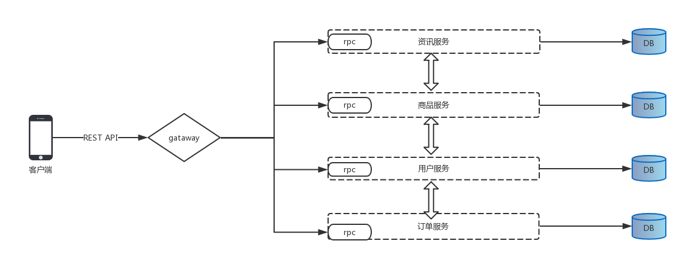

## mall-micro 基于单体应用重构更新中  年底有点忙，要隔段时间继续更新...
## 申明: 个人作品，写的不好的地方望交流谢谢
 * 基于go-micro微服务实战，涉及视频资讯，电商支付，广告发布等需求
 * [配套基于React-native开发Android、iOS](https://github.com/TorettoLong/mall-app)
 * 基于Vue和Springboot构建的后台管理系统 [前端代码](https://github.com/TorettoLong/mall-admin) [API代码](https://github.com/TorettoLong/mall-admin-java)
 * 为了方便暂时gateway 先只是聚合接口

## 简易架构图

 
## 功能点
  * 使用rabbitmq中间件, 实现延迟队列
  * 重试，限流，熔断，健康检查
  * consul务发现
  * JWT Authorization token认证
  * redis连接池，实现缓存
  * MongoDB范围数据查询
  * elastic stack 实现数据搜索, 日志分析
  * ......

## 运行步骤
 * make build
 * docker-compose build
 * docker-compose up
 
## 内容
  * 登陆: 短信 微信 facebook 
  * 视频: 视频播放
  * 新闻: 新闻详情，资讯列表
  * 发布广告
  * 上传图片七牛
  * 支付宝支付
  * 银联支付
  * ......

## 前端部分页面展示

## govendor命令使用
* init	初始化 vendor 目录
* list	列出所有的依赖包
* add	添加包到 vendor 目录，如 govendor add +external 添加所有外部包
* add PKG_PATH	添加指定的依赖包到 vendor 目录
* update	从 $GOPATH 更新依赖包到 vendor 目录
* remove	从 vendor 管理中删除依赖
* status	列出所有缺失、过期和修改过的包
* fetch	添加或更新包到本地 vendor 目录
* sync	本地存在 vendor.json 时候拉去依赖包，匹配所记录的版本
* get	类似 go get 目录，拉取依赖包到 vendor 目录

## 交流方式-微信

