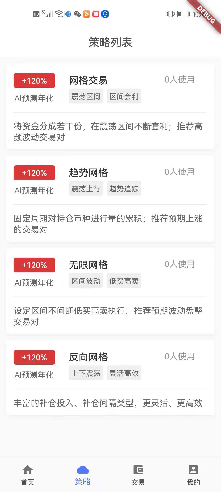

### 申明: 个人作品，不可用于交易，写的不好的地方望交流谢谢
#### iFortune一款网格量化交易服务，提供网格策略交易、趋势网格、反向网格等免费量化交易策略，已支持接入Huobi、OKex、Binance等主流交易平台，覆盖USDT、BTC、ETH等多种交易对，通过API一键配置策略，智能自动交易。同时设置专业完善的风控体系保障账户安全，保护策略安全，最大程度降低量化投资风险。
### 采用的技术
* 基于go-micro微服务实战
* 基于k8s编排，Jenkins持续交付
* [配套基于Flutter开发Android、iOS、Web](https://github.com/RonadoLong/wq-fotune.git)
* [APP体验版本:https://www.pgyer.com/gnTX](https://www.pgyer.com/gnTX)

### 简易架构图

### 前端部分页面展示

### 待完成功能
* 摒弃go-micro迁移到bilibili的go-kratos
* 实时行情看板
* 更多币种交易
* 利用redis zset做策略收益的时候排行榜  
* 引入消息队列解耦，解决分布式事务问题
* 引入基于redis布隆过滤器
* 利用epoller模式优化websocket中的go wait模式